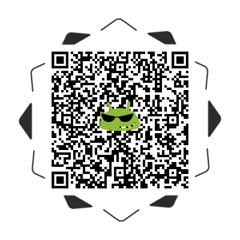

# android_sample_opencv4
android sample of opencv4
developed based on the [opencv][1]

### Screenshot
  

### Sample
|  |
| :--------:                      |
| Scan QR code or [Download][2]   |

### About Build
* NDK
* CMake
* [Source][3]

### About Author:
* Author: shengjunhu
* Date  : 2020/09/10
* E-Mail: shengjunhu@foxmail.com
* GitHub: https://github.com/hushengjun

### About License
```
Copyright (c) 2020 shengjunhu
Please compliance with the OpenCV license
```

[1]: https://github.com/opencv/opencv
[2]: https://github.com/shengjunhu/android_sample_opencv4/raw/master/doc/apk/sample_opencv4_v20092719_release.apk
[3]: doc/file/opencv-4.4.0.zip
